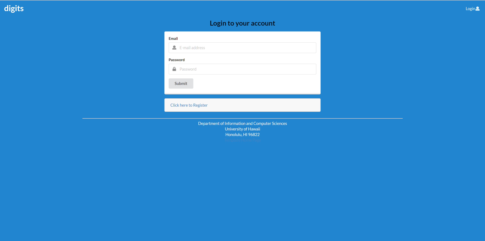
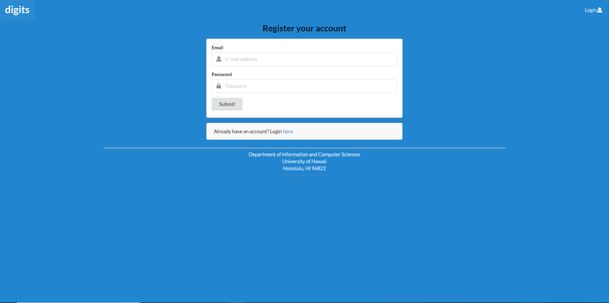
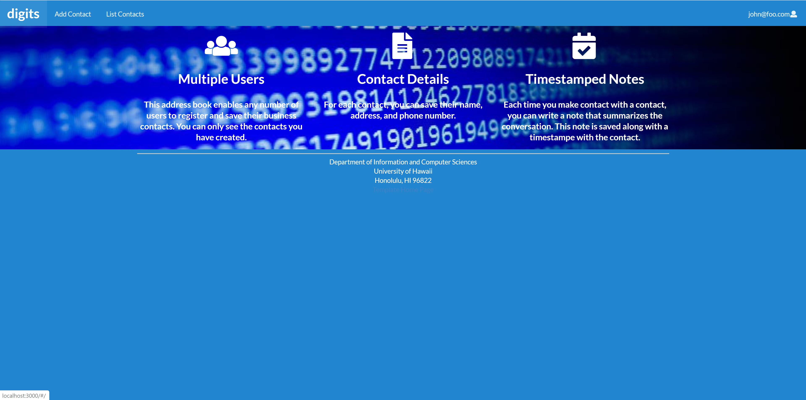
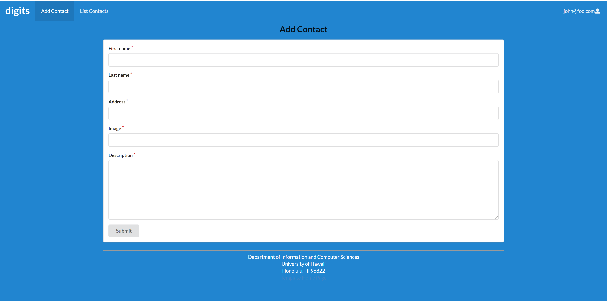
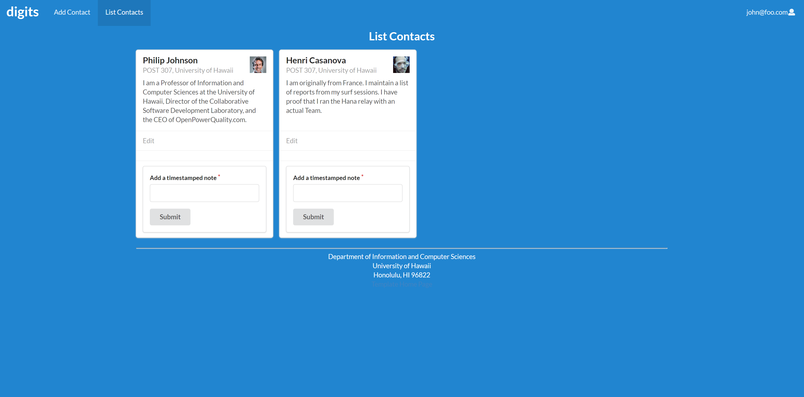
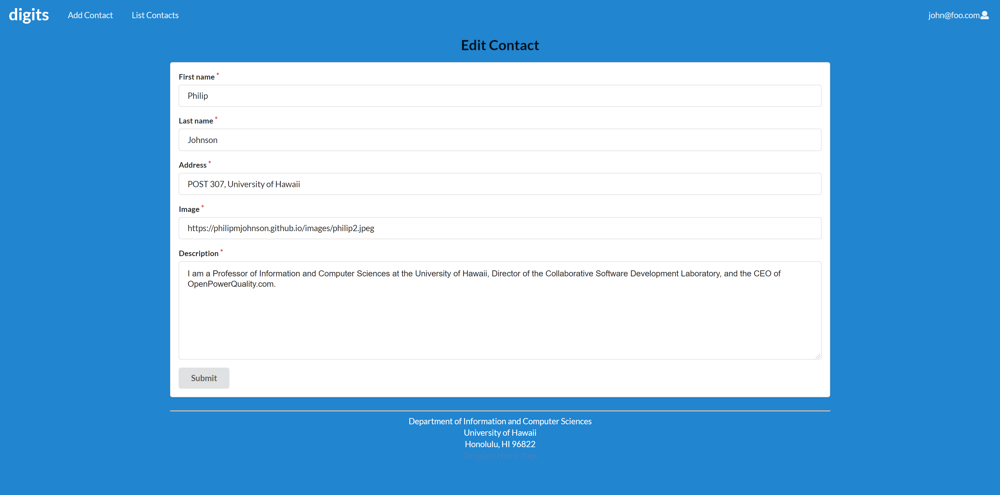
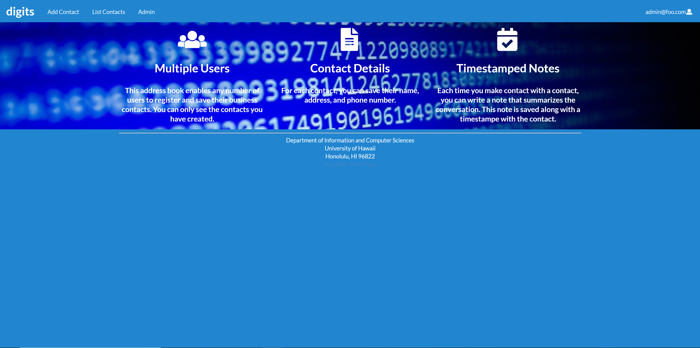
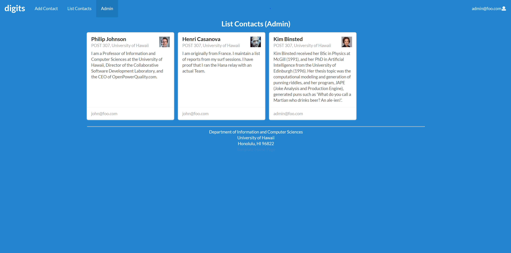

## Installation

1. [Install Meteor](https://www.meteor.com/install).

2. Go to the [Digits](https://github.com/kryf/digits) repository, and click the "Use this template" button. Complete the dialog box to create a new repository that you own that is initialized with this template's files.

3. Go to your newly created repository, and click the "Clone or download" button to download your new GitHub repo to your local file system.  Using [GitHub Desktop](https://desktop.github.com/) is a great choice if you use MacOS or Windows.

4. cd into the app/ directory of your local copy of Digits, and install third party libraries with:

```
$ meteor npm install
```

## Running the system

Once the libraries are installed, you can run the application by invoking the "start" script in the [package.json file](https://github.com/ics-software-engineering/meteor-application-template-react/blob/master/app/package.json):

```
$ meteor npm run start
```

The first time you run the app, it will create some default users and data. Here is the output:

```
meteor npm run start

> meteor-application-template-react@ start /Users/philipjohnson/github/ics-software-engineering/meteor-application-template-react/app
> meteor --no-release-check --settings ../config/settings.development.json

[[[[[ ~/github/ics-software-engineering/meteor-application-template-react/app ]]]]]

=> Started proxy.
=> Started MongoDB.
I20180227-13:33:02.716(-10)? Creating the default user(s)
I20180227-13:33:02.742(-10)?   Creating user admin@foo.com.
I20180227-13:33:02.743(-10)?   Creating user john@foo.com.
I20180227-13:33:02.743(-10)? Creating default data.
I20180227-13:33:02.743(-10)?   Adding: Basket (john@foo.com)
I20180227-13:33:02.743(-10)?   Adding: Bicycle (john@foo.com)
I20180227-13:33:02.743(-10)?   Adding: Banana (admin@foo.com)
I20180227-13:33:02.744(-10)?   Adding: Boogie Board (admin@foo.com)
=> Started your app.

=> App running at: http://localhost:3000/
```


### Note regarding "bcrypt warning":

You will also get the following message when you run this application:

```
Note: you are using a pure-JavaScript implementation of bcrypt.
While this implementation will work correctly, it is known to be
approximately three times slower than the native implementation.
In order to use the native implementation instead, run

  meteor npm install --save bcrypt

in the root directory of your application.
```

On some operating systems (particularly Windows), installing bcrypt is much more difficult than implied by the above message. Bcrypt is only used in Meteor for password checking, so the performance implications are negligible until your site has very high traffic. You can safely ignore this warning without any problems during initial stages of development.

### Note regarding "MongoError: not master and slaveOk=false":

Intermittently, you may see the following error message in the console when the system starts up:

```
MongoError: not master and slaveOk=false
     at queryCallback (/Users/philipjohnson/.meteor/packages/npm-mongo/.3.1.1.1mmptof.qcqo++os+web.browser+web.browser.legacy+web.cordova/npm/node_modules/mongodb-core/lib/cursor.js:248:25)
     at /Users/philipjohnson/.meteor/packages/npm-mongo/.3.1.1.1mmptof.qcqo++os+web.browser+web.browser.legacy+web.cordova/npm/node_modules/mongodb-core/lib/connection/pool.js:532:18
     at _combinedTickCallback (internal/process/next_tick.js:131:7)
     at process._tickDomainCallback (internal/process/next_tick.js:218:9)
```

While irritating, this message appears to be harmless and [possibly related to a race condition between the development instance of Mongo and Meteor](https://github.com/meteor/meteor/issues/9026#issuecomment-330850366). By harmless, I mean that in most cases, the console goes on to display `App running at: http://localhost:3000/` and no problems occur during run time.

### Viewing the running app

If all goes well, the template application will appear at [http://localhost:3000](http://localhost:3000).  You can login using the credentials in [settings.development.json](https://github.com/ics-software-engineering/meteor-application-template-react/blob/master/config/settings.development.json), or else register a new account.

## Walkthrough

The following sections describe the major features of this template.

### Application functionality

The application creates a list of contacts and allows the addition of timestamped notes to each contact. The user is permitted to add new contacts or edit existing contact information.

"Admin" users are allowed access to an additional contact list, which shows the contacts for all users.

#### Landing page

When you retrieve the app at http://localhost:3000, this is what should be displayed:


The login in the top right of the page allows returning users to sign-in or new users to register.

#### Login page

Clicking on the Login link, then on the Sign In menu item displays this page:




#### Register page

Alternatively, clicking on the Login link, then on the Sign Up menu item displays this page:





#### Landing (after Login) page, non-Admin user

Once you log in (either to an existing account or by creating a new one), the navbar changes as follows:




There are two tabs: "Add Contact" and "List Contacts".

#### Add Contact page

After logging in, there is a new page which allows new contacts to be added:




#### List Contacts page

After logging in, the new page allows the user to view their contacts. There is also the option to add a timestamped note to a contact, and provides the option to edit the contact.




Clicking the edit button will bring the user to the "Edit Contact" page.

#### Edit Stuff page

The edit page allows the user to make changes to a contact's information. 




Pressing the submit button updates the contact's information which can be viewed again by going back to the "List Contacts" page.

#### Landing (after Login), Admin user

Logging in as the "admin" user produces a similar landing page; however, a new "Admin" tab can be seen on the navbar:




#### Admin page (list all users contacts)

The new "Admin" page allows the "admin" user to view all users' contacts:




The contacts display which user the contact belongs to. This feature is only available for the "admin" user.
